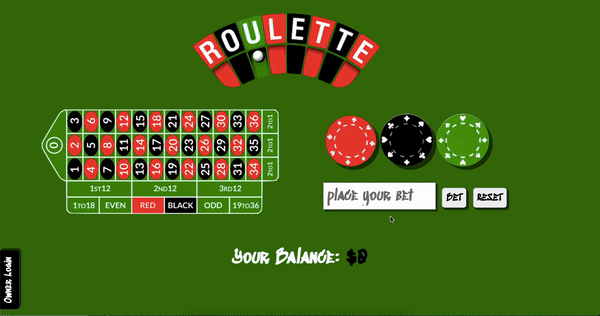

## Goal
Build a fullstack Roulette App -  where the public should be able to bet any amount and either win or lose, and the casino owner should be able to log in and see the total wins / losses && how much money has been made || lost

## How it's made
Made using CSS, Javascript, Node.js, JSON, Express, EJS, MongoDB, and User Authentification using passport.

## Lessons Learned
Whew... it is hard finishing projects about gambling - cause I don't know anything about that! But regardless of that learning curve, this project taught me a lot about the use of passports and if I had more time available, I'd like to go back to simplify the code a bit more.
